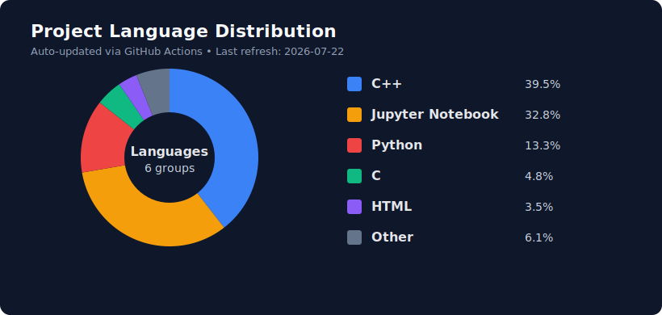

# Hey there, I'm Mozeel-V 👋

Welcome to my GitHub profile! I'm a Computer Science and Engineering student at **IIT Kharagpur**, focused on low-level systems engineering and AI/ML-driven applications. I enjoy building projects that balance core computer science fundamentals with practical impact.

## 🎓 About Me

- 🎯 **UG Student** at IIT Kharagpur pursuing Computer Science and Engineering
- ⚙️ Exploring **C/C++ low-level systems** and core fundamentals through projects like VolcanoDB and virtual filesystem design
- 🤖 Focused on **Machine Learning, Retrieval, and NLP** through practical projects like SetFit, spam detection, and medical assistants
- 🚀 Building end-to-end systems that combine software fundamentals with intelligent behavior
- 🌱 Deeply invested in learning by implementing ideas from scratch

## 🛠️ Skills & Technologies

- **Systems & Fundamentals:** C, C++, operating-system concepts, file systems, transport protocols
- **Languages:** Python, JavaScript, Java, C, C++
- **ML/Retrieval/NLP:** PyTorch, TensorFlow, LangChain, SetFit, Retrieval Augmented Generation (RAG)
- **Backend & APIs:** Node.js, Flask, Express.js, REST APIs
- **Frontend:** React, HTML5, CSS3, JavaScript ES6+
- **Databases:** MongoDB, PostgreSQL, Pinecone
- **Tools & Platforms:** Git, Docker, Linux

## 📌 Featured Projects

### [VolcanoDB](https://github.com/Mozeel-V/volcano-db)
A low-level database systems project focused on core storage and query execution fundamentals, inspired by Volcano-style architecture and systems-first design.
- **Focus Areas:** C/C++ systems programming, database internals, execution model fundamentals
- **Highlights:** Core data structures, low-level implementation details, performance-oriented thinking

### [DevNest](https://github.com/Mozeel-V/code-editor)
A developer-focused code editor project designed to strengthen practical understanding of editor architecture, usability, and tooling workflows.
- **Focus Areas:** Developer tooling, editing workflows, UI + systems integration
- **Highlights:** Productivity-centric features, clean editing experience, extensible project structure

### [MediBot](https://github.com/Mozeel-V/medical-chatbot)
An ML/Retrieval-powered medical assistant that uses NLP techniques to understand symptoms and provide context-aware guidance.
- **Focus Areas:** NLP, retrieval-augmented reasoning, healthcare-oriented conversational AI
- **Highlights:** Query understanding, retrieval pipeline integration, practical AI assistant behavior

## 🧠 Current Interests & Learning

- ⚙️ **Low-Level C/C++ Systems** - Building fundamentals-first projects such as VolcanoDB, virtual-file-system, and kgp-transport-protocol
- 🗂️ **Systems Design Fundamentals** - Storage models, transport mechanisms, and performance-oriented implementation
- 🔍 **ML + Retrieval + NLP** - Learning through projects like setfit-project, medical-chatbot, and spam-detection
- 🤝 **Practical AI Applications** - Combining retrieval pipelines and language models for real-world assistants

## 📊 GitHub Stats

> Using a repository-hosted chart instead of an external stats API for better reliability.

## 🤝 Let's Connect!

I am always open to collaborating on interesting projects, discussing ideas, or exploring opportunities in AI/ML and full-stack development. 

- 💼 [LinkedIn](https://www.linkedin.com/in/mozeel-vanwani/)
- 📧 [Email](mailto:vanwani.mozeel@gmail.com)

---

*"Innovation is the intersection of curiosity and execution."*  
Last updated: July 2026
